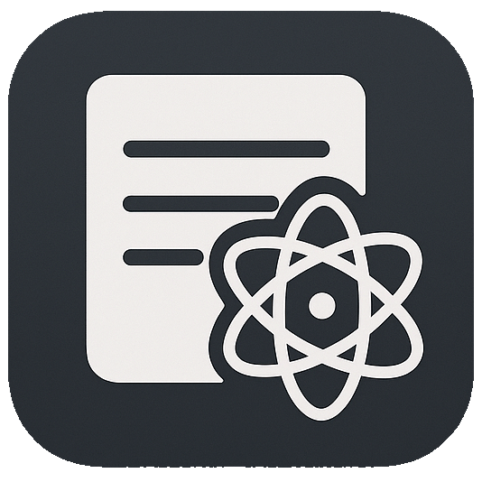

# Notes - Desktop Markdown Editor 

**A modern, feature-rich desktop notes application built with Electron, React, and TypeScript**

[](https://github.com/yourusername/notes)
[](https://github.com/yourusername/notes)
[](https://github.com/yourusername/notes)

## 📖 Overview

Notes is a powerful desktop application designed for creating, editing, and managing markdown notes. Built with modern web technologies and packaged as a native desktop app, it provides a seamless writing experience with real-time markdown preview, file management, and cross-platform compatibility.

## ✨ Features

- **📝 Rich Markdown Editor**: Powered by Milkdown with live preview and syntax highlighting
- **📁 File Management**: Create, organize, and manage multiple notes with ease
- **🔄 Auto-save**: Automatic saving with debounced updates to prevent data loss
- **📱 Cross-platform**: Available for Windows, macOS, and Linux
- **🎨 Modern UI**: Clean, intuitive interface built with React and Tailwind CSS
- **⚡ Performance**: Fast and responsive with Electron's native performance
- **🔍 Search & Navigation**: Quick access to notes with sidebar navigation
- **📅 Timestamps**: Automatic tracking of creation and modification dates

## 🖼️ Screenshots

### Main Application Window


### Editor Interface


### Sidebar Navigation


### Note Management


## 🚀 Installation

### Prerequisites

- Node.js (v18 or higher)
- npm or yarn package manager

### Development Setup

1. Clone the repository:

   ```bash
   git clone https://github.com/yourusername/notes.git
   cd notes
   ```

2. Install dependencies:

   ```bash
   npm install
   ```

3. Start development mode:
   ```bash
   npm run dev
   ```

### Building for Production

#### Windows

```bash
npm run build:win
```

#### macOS

```bash
npm run build:mac
```

#### Linux

```bash
npm run build:linux
```

#### All Platforms

```bash
npm run build
```

## 🛠️ Development

### Project Structure

```
src/
├── main/           # Electron main process
├── preload/        # Preload scripts
├── renderer/       # React application
│   ├── components/ # React components
│   ├── hooks/      # Custom React hooks
│   ├── store/      # State management
│   └── utils/      # Utility functions
└── shared/         # Shared types and utilities
```

### Available Scripts

- `npm run dev` - Start development server with hot reload
- `npm run build` - Build the application
- `npm run start` - Preview the built application
- `npm run lint` - Run ESLint
- `npm run typecheck` - Run TypeScript type checking
- `npm run format` - Format code with Prettier

### Technology Stack

- **Frontend**: React 18, TypeScript, Tailwind CSS
- **Desktop**: Electron 34
- **Editor**: Milkdown (Markdown editor)
- **Build Tool**: Electron Vite
- **Package Manager**: npm

## 📱 Usage

### Creating Notes

1. Click the "Add Notes" button in the sidebar
2. A new note will be created with a default title
3. Start typing to add content

### Editing Notes

1. Select a note from the sidebar
2. Use the markdown editor to write content
3. Content is automatically saved as you type

### Managing Notes

- Click on any note in the sidebar to open it
- Notes are automatically organized by modification date
- Each note shows creation and last modified timestamps

### Markdown Support

The editor supports standard markdown syntax including:

- Headers (# ## ###)
- Lists (bulleted and numbered)
- **Bold** and _italic_ text
- [Links](url)
- `Code blocks`
- And much more!

## 🔧 Configuration

### Electron Builder Configuration

The application uses `electron-builder.yml` for build configuration, supporting:

- Multiple platform builds
- Auto-updater integration
- Custom installer options

### Development Configuration

- `electron.vite.config.ts` - Vite configuration for Electron
- `tsconfig.json` - TypeScript configuration
- `eslint.config.mjs` - ESLint configuration
- `postcss.config.mjs` - PostCSS configuration

## 📦 Distribution

The application can be built for multiple platforms:

- **Windows**: `.exe` installer and portable versions
- **macOS**: `.dmg` installer
- **Linux**: `.AppImage` and `.deb` packages

## 🤝 Contributing

We welcome contributions! Please feel free to submit issues, feature requests, or pull requests.

### Development Guidelines

1. Fork the repository
2. Create a feature branch
3. Make your changes
4. Add tests if applicable
5. Submit a pull request

## 📄 License

This project is licensed under the MIT License - see the [LICENSE](LICENSE) file for details.

## 🙏 Acknowledgments

- [Milkdown](https://milkdown.dev/) - Markdown editor framework
- [Electron](https://www.electronjs.org/) - Cross-platform desktop app framework
- [React](https://reactjs.org/) - UI library
- [Tailwind CSS](https://tailwindcss.com/) - Utility-first CSS framework

## 📞 Support

If you encounter any issues or have questions:

- Create an issue on GitHub
- Check the documentation
- Review existing issues for solutions

---

<div align="center">

**Made with ❤️ using Electron by Brijraj**

</div>
